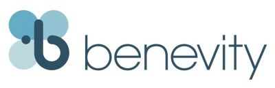

# Benevity - Improve your corporate giving



## Overview and Origin

* Name of company

    The name of company is Benevity. They are market leader in charitable donation and grant management platform. 
---
* When was the company incorporated?

    The company was incorporated in 2008.
---
* Who are the founders of the company?

    The company was started by Bryan de Lottinville. He currently serves as the CEO of the company. Bryan was a successful finance lawyer before he ventured into an entrepreneurial, web-based technology business with iStockphoto, a successful venture that was eventually sold to Getty Images.

    * [Source - Calgaryherald](https://calgaryherald.com/business/local-business/around-town-june-4-benevity)
---
* How did the idea for the company (or project) come about?

    Back in 2008, The company founder Bryan  was shocked by the fact that less than **five per cent of donations in a $350-billion industry** were from corporations and **less than seven per cent were processed online**, he decided to improve those numbers. With his experience in previous venture, specifically in web-based technologies, he had the vision what needs to be done to change grant management ecosystem. 

    * [Source - Calgaryherald](https://calgaryherald.com/business/local-business/around-town-june-4-benevity)
---
* How is the company funded? How much funding have they received?

    Overall, Benevity recieved **$ 69.2 USD million** over three series of round. Most of the funding is from JMI Equity and General Atlantic. 

    Funding details:

    Date | Transaction Name | Money raised | Lead Investor
    ------------ | -------------| -------------| -------------| 
    Oct 22, 2019    | Series C | $ 40 M | N/A
    Oct 22, 2019    | Series C |  N/A | General Atlantic
    Oct 22, 2019    | Series C | $ CAD 38 M | JMI Equity

    * [Source - Crunchbase Financials](https://www.crunchbase.com/organization/benevity/funding_financials)
---
## Business Activities:

* What specific financial problem is the company or project trying to solve?

    Benevity supports corporation goodness program and it helps organization in workplace giving, matching, volunteering, disaster relief and corporate granting. It is using technology to enable a better workplace giving programs that improve employee engagement, recruitment and retention and can be used to enrich a more positive culture. It is also creating a more efficient way to support more charities, so charities can focus on their important social missions. 

    Apart from that Benevity is a Certified B corporation. As a certified B corporation, Benevity needs to balance purpose and profit. They are legally required to consider the impact of their decisions on their workers, customers, suppliers, community, and the environment.

    * [Source - Benevity](https://www.benevity.com/why-benevity)
    * [Source - BCorp](https://bcorporation.net/)
---
* Who is the company's intended customer?  Is there any information about the market size of this set of customers?

    Intendend customers are the corporations. In most cases, it is not economical for these corporations to develop a complete grant management platform. Instead, they will purchase these platforms as software-as-a-solution (SaaS) for a low fee and integrated with their systems. 

    According to MarketsandMarkets research, Global grant management software market size will grow from USD 1.1 billion in 2019 to USD 1.9 billion by 2024, at a Compound Annual Growth Rate (CAGR) of 10.5% during the forecast period. Growing need among enterprises to improve the grant process and acceleration of grant application review is expected to drive the growth of the grant management software market across various end users globally.

    * [Source - Markets&Markets](https://www.marketsandmarkets.com/Market-Reports/grant-management-software-market-42804168.html)
---
* What solution does this company offer that their competitors do not or cannot offer? (What is the unfair advantage they utilize?)
    
    In the initial days, Benevity was a market leader in workplace giving and volunteer management software. They acquired GrantStream in 2015 who is long-recognized leader in grants management software. They also acquired Versaic and Trust CSR Ltd in 2018 and able to offer entire corporate goodness program under one umberlla. 

    * [Source - GrandStream](https://www.benevity.com/press-releases/benevity-acquires-grantstream-offering-single-integrated-solution-that-delivers-greater-engagement-and-impact)
    * [Source - Crunchbase](https://www.crunchbase.com/organization/benevity#section-overview)
---
* Which technologies are they currently using, and how are they implementing them? (This may take a little bit of sleuthing–– you may want to search the company’s engineering blog or use sites like Stackshare to find this information.)

    Benevity product is called ***Spark*** and it is offered as Software-as-a-Solution (SaaS). Spark API (Goodness API) can support e-commerce integrations, loyalty rewards programs and transactional interfaces. Also, it meets WCAG 2.0 AA standards and integrates with Workday, HR management platform. 

    * [Source Benevity Technology](https://www.benevity.com/#:~:text=The%20Benevity%20Goodness%20Platform%20helps,power%20pro%2Dsocial%20brand%20engagement.)
    * [Source - WCAG](https://www.w3.org/WAI/standards-guidelines/wcag/)
---
## Landscape:

* What domain of the financial industry is the company in?

    Benevity comes under the broder domain of HR, payroll and benefits. It helps the organization in workplace giving, matching, volunteering, disaster relief and corporate granting etc., 
---
* What have been the major trends and innovations of this domain over the last 5-10 years?

    1. Transition from off the shelf product to cloud based product
    2. Increase in use of electronic payments to process the donation, grants and payments. 
    3. Built-in reporting platform to manage and analyze user engagement and other metrics
    4. Ease of integration with the systems 
    5. Ease of use from users prespective
---
* What are the other major companies in this domain?

    1. Smart simple 
    2. Blackbaud 
    3. JK Group 
    4. Sponsorium 

    Of all of the companies mentioned, Blackbaud is a major player in this segment. It is listed in NASDAQ exchange. Back in 2014, Blackbaud  acquired MicroEdge for $160. Microedge is one of the local competitors for Benevity. 

    * [Source - Competitors](https://www.businesswire.com/news/home/20140902005729/en/Blackbaud-Acquire-MicroEdge)
---
## Results

* What has been the business impact of this company so far?

    > **“Without a sense of purpose, no company, either public or private, can achieve its full potential"**  - Larry Fink, CEO of Blackrock 

    One of the huge shifts in the corporation is the preference of the employees to work for a companies that have a social and environmental purpose. In 2014 IBM institute study, Desire to work for corporation that supports social and environment was the second on the list of career goal. 

    It is important to note that Benevity is the first certified B Corps in Canada. The company has over 2 million users around the world and it processed over 2 billion dollars in donation and 10 million hours of volunteering time to 150,000 charities. Apart from that it holds almost 2 million charities and platform is available in 17 languages. 
    
    * [Source - Forbes](https://www.forbes.com/sites/afdhelaziz/2018/07/02/how-benevity-is-unleashing-employee-purpose-as-a-competitive-advantage/#7c7a54a64c2f)
---

* What are some of the core metrics that companies in this domain use to measure success? How is your company performing, based on these metrics?


* How is your company performing relative to competitors in the same domain?

    Benevity is a relatively a niche player compared other major player such as Blackbaud. Benevity focus on corporate giving program and they are able to expand the prodcuct offering by strategic acquistion (GrantStream in 2015) and organic internal development. 

## Recommendations

* If you were to advise the company, what products or services would you suggest they offer? (This could be something that a competitor offers, or use your imagination!)

    Benvity soley focus on corporate giving platforms. Benevity can expand to other areas of grant management such as Government, Art & Culture, Research funding, Healthcare and Scholarship providers. Though, Benevity platform has millions of charities, it is viewed from corporation prespective not the other way around. They can leverage these platforms to act as a bridge between corporation and non-profits. 

    In fact, Benevity created Benevity one wold in 2016 that will allow coroporation to give donation for an internation disaster. In 2018, Benevity one platform processed closed to $ 800k donation. 
--- 
* Why do you think that offering this product or service would benefit the company?

    Benevity will have a much broder ecosystem for the grant management. It also provides more options for the corportation to fund some of these instituion. 

* What technologies would this additional product or service utilize?


* Why are these technologies appropriate for your solution?

```

### 4. Write the case study

Write the finished case study report in a markdown `README.md` file, using the above case study template. Your report should be sufficiently long to ensure you provide all relevant information about the company or project in a thorough manner.

Be sure to cite your sources in an addendum at the end of the report. List all websites, podcasts, blogs, or articles that you consulted in order to write the report, and provide links. Your list should be thorough and account for all sources you used, but it does not need to be a formal works cited page.

### 5. Upload your case study to your git repository

You learned some technical aspects of FinTech this week, including how to set up and populate a git repository. As a final step, take your finished case study and upload it to a repository to share with your instructor and class.

---

## Resources

### FinTech Companies and Domains

For an overview of some of the most successful companies across FinTech domains, check out these resources:

* [Canada has a rosy future in fintech, but obstacles remain, expert says](https://www.cpacanada.ca/en/news/innovation/2019-11-04-canada-fintech-trends)

* [Canadian fintech adoption rate hits 50 per cent, but still trails global peers: EY](https://business.financialpost.com/technology/canadian-fintech-adoption-rate-hits-50-per-cent-but-still-trails-global-peers-ey)

* [The 2019 Canadian fintech market map](https://www.pwc.com/ca/en/industries/technology/canadian-fintech-market-map.html)

* [Canadian Fintech Industry Set to Witness Strong Grow: Report](https://fintechnews.ch/fintech/fintech-canada-report/19783/)

* [Introducing the FinTech Landscape in Canada](http://www.industryandbusiness.ca/development-and-innovation/introducing-the-fintech-landscape-in-canada)

* [Status of the Canadian FinTech Landscape](https://www.cfamontreal.org/static/uploaded/Files/Presentation/19-02-07-David_Nault_Rendez-Vous-Fintech_CFA-Montreal.pdf)

* [The Canadian Fintech Ecosystem Map](https://ecosystem.formfintech.com/)

* [World FinTech Report 2019, Capgemini](https://fintechworldreport.com/)

* [The Most Innovative FinTech Companies in 2019, Forbes](https://www.forbes.com/fintech/2019/#5264de5a2b4c)

* [The Future of FinTech and Banking, Accenture](https://www.accenture.com/us-en/insight-future-fintech-banking)

* [Scanning the FinTech Landscape: 10 Disruptive Models, McKinsey & Company](https://www.mckinsey.com/industries/financial-services/our-insights/banking-matters/scanning-the-fintech-landscape)

### Research Material

As you research your company, you may find these types resources to be useful:

* The company’s website

* The company’s blog

* Company press releases (These can often be found on the Press page of the company's website, or via Google search.)

* Websites of competitors

* FinTech blogs and/or podcasts

* Interviews with the company’s founders, CTOs, or project leads

* Reports devoted to the particular FinTech domain you are focusing on (e.g.,  FinTech in the mortgage industry)

* [Forbes](https://www.forbes.com/fintech/#39ae67bc13f1)

* [McKinsey & Company](https://www.mckinsey.com/featured-insights/fintech)

* [Reuters](https://www.reuters.com/news/archive/RCOMUS_Fintech)

* [TechCrunch](https://techcrunch.com/tag/fintech/)

* [Deloitte](https://www2.deloitte.com/us/en/pages/risk/articles/fintech-trends-insights.html)

* [Built In](https://builtin.com/fintech)

* [FinTech Weekly](https://www.fintechweekly.com/)

* [KPMG](https://home.kpmg/us/en/home/industries/financial-services/fin-tech.html)

* [Stack share](https://stackshare.io/)

* [Crunchbase](https://www.crunchbase.com/hub/fintech-startups#section-overview)

* [Angelist](https://angel.co/finance-technology)

---

## Submission

* Create a repository for this homework on GitHub.

* Upload the README file containing your case study report to this repository.

* Submit the link to your GitHub repository to Bootcamp Spot.

---
© 2020 Trilogy Education Services, a 2U, Inc. brand. All Rights Reserved.


